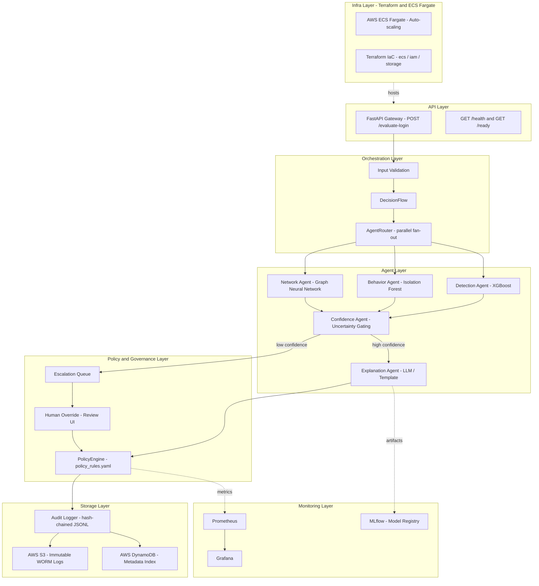

# AegisAI: Agentic Fraud & Trust Intelligence System

AegisAI is an agentic AI system for Account Takeover (ATO) detection in digital banking and fintech environments. Unlike traditional fraud systems that optimize for detection accuracy, AegisAI treats **trust as a system-level property** rather than a model metric.

---

## 1. Executive Summary

AegisAI is a **governed decision-making system** designed to protect high-stakes digital environments from account takeover. It uses a **multi-agent architecture** to separate risk prediction from decision authority, ensuring that AI only makes decisions when confidence is high and policy allows. The system features a **human-in-the-loop escalation** mechanism for ambiguous cases and an **immutable, hash-chained audit trail** for regulatory compliance and transparency.

**Key Value Propositions:**
- **Controlled Autonomy**: AI only decides when it's certain; humans handle the rest.
- **Traceable Decisions**: Every action is logged with its full reasoning and lineage.
- **Policy-First Governance**: Hard constraints override model outputs to ensure safety.
- **Enterprise-Ready**: Designed with modularity, scalability, and auditability at its core.

---

## 2. Problem Framing

Traditional fraud detection systems focus on **accuracy metrics** (Precision/Recall), which often fails in high-stakes production environments:

- **The False Positive Paradox**: A 99% accurate model that blocks 1% of legitimate users can destroy customer trust and increase support costs.
- **The Transparency Gap**: Black-box models cannot explain *why* a user was blocked, making regulatory compliance and manual review difficult.
- **The Authority Risk**: Purely automated systems can be "tricked" by novel attacks if they don't have a mechanism for restraint.

AegisAI solves this by prioritizing **Trust and Reliability** over raw accuracy, explicitly modeling uncertainty and escalating to humans when necessary.

---

## 3. System Architecture

AegisAI follows a **multi-agent, parallel-execution architecture** where no single model has absolute authority.

### High-Level Layered Architecture



### Agent Roles & Contracts

| Agent | Purpose | Primary Signal | Constraint |
|-------|---------|----------------|------------|
| **Detection** | Anomaly Detection | XGBoost risk scores | Cannot make decisions |
| **Behavior** | Pattern Consistency | Isolation Forest patterns | No network context |
| **Network** | Relational Risk | Graph Neural Network (GNN) | Evidence only, no verdicts |
| **Confidence** | Gatekeeper | Uncertainty/Disagreement | Cannot generate actions |
| **Explanation**| Action & Reasoning | LLM/Template-based | Must obey policy rules |

---

## 4. Design Decisions & Tradeoffs

- **Separation of Prediction and Decision**: Agents produce *signals*, but only the orchestrator (gated by confidence) produces *decisions*. This prevents single-model bias from cascading.
- **Immutability over Performance**: We use a frozen `DecisionContext` and hash-chained audit logs. This adds a slight latency overhead but guarantees that no decision can be tampered with post-hoc.
- **Conservative Action Defaults**: When in doubt, the system defaults to `CHALLENGE` or `ESCALATE` rather than `ALLOW` or `BLOCK`, prioritizing security and user trust.
- **Vanilla CSS & Standard Frameworks**: For the UI (if applicable) and API, we use standard, flexible tools like FastAPI and Vanilla CSS to avoid vendor lock-in and ensure long-term maintainability.

Detailed architectural decisions are recorded in [docs/adr/](docs/adr/).

---

## 5. Failure Modes

AegisAI is designed to fail gracefully. Known failure modes include:

- **The Travel Trap**: A legitimate user logging in from a new country might trigger high risk. *Mitigation: Confidence agent detects novelty and escalates to human review.*
- **Low-and-Slow Attacks**: Sophisticated attackers might mimic behavior perfectly. *Mitigation: Network Agent identifies shared infrastructure and relational anomalies.*
- **Systemic Bias**: Human reviewers might consistently override certain types of correct AI decisions. *Mitigation: Human Override Rate monitoring and periodic policy/model retraining.*
- **Infrastructure Latency**: High-traffic bursts might slow down parallel execution. *Mitigation: Timeouts and fallback "Safe Mode" actions.*

---

## 6. Observability & Evaluation

We track metrics that reflect real-world trust, not just model performance:

| Metric | Goal | Rationale |
|--------|------|-----------|
| **False Positive Rate (FPR)** | < 5% | Minimizes harm to legitimate users. |
| **Escalation Rate** | 5-30% | Measures how often the AI exercises healthy restraint. |
| **Human Override Rate** | < 20% | Indicates AI-Human alignment and model drift. |
| **Calibration Error** | < 0.10 | Ensures the AI is "honest" about its uncertainty. |
| **Policy Violation Count** | **0** | Proves the governance layer is enforcing hard limits. |

### Benchmarks

We maintain a high-performance decision pipeline validated at **two levels**:

#### In-Process Core Flow (DecisionFlow)

| Metric | Goal | Benchmark |
|--------|------|-----------|
| **Mean Latency** | < 1.0 ms | `benchmarks/latency_benchmark.py` |
| **Throughput** | > 2000 req/s | `benchmarks/latency_benchmark.py` |

```bash
export PYTHONPATH=$PYTHONPATH:$(pwd)/src
python benchmarks/latency_benchmark.py
```

#### HTTP API Load Test — 200 Concurrent Users (Locust)

Exercises the full HTTP stack end-to-end: FastAPI gateway → DecisionFlow → PolicyEngine → AuditLogger.

Under a 200-user concurrent load test on a single-node environment, AegisAI sustained ~309 RPS with 0% error rate and P95 latency of 500ms at ~92% CPU utilization, indicating compute-bound scaling behavior.

| Metric | Result (200 Users) | How measured |
| :--- | :--- | :--- |
| **P50 HTTP Latency** | **300 ms** | Locust built-in stats |
| **P95 HTTP Latency** | **500 ms** | Locust built-in stats |
| **P99 HTTP Latency** | **590 ms** | Locust built-in stats |
| **Steady State RPS** | **309.3** | Locust total RPS |
| **Error Rate** | **0.00%** | Locust failure counter |
| **Mean CPU (Local Docker)** | **92.5%** | `psutil` sampler |
| **Peak CPU (Local Docker)** | **99.1%** | `psutil` sampler |


**Monitoring Tools**:
- **Prometheus/Grafana**: For real-time metrics (latency, throughput, escalation spikes).
- **MLflow**: For model versioning and artifact tracking.
- **S3 Audit Store**: For historical analysis and compliance reporting.

---

## 7. Scaling Strategy & Considerations

AegisAI is built on a serverless, horizontally-scalable architecture designed to handle high-concurrency fraud detection.

- **Audit Layer**: Uses **S3** for immutable storage (virtually infinite scale) and **DynamoDB** for fast metadata lookups (low-latency, auto-scaling).
- **Compute**: Deployment on **AWS ECS (Fargate)** ensures the compute layer scales horizontally based on request volume.
- **Parallel Agent Execution**: The `AgentRouter` executes independent agents in parallel, keeping end-to-end latency constant even as new agents are added.
- **Key Considerations**: Includes data partitioning (Hot Key mitigation), resource contention management, and future streaming ingestion via Kafka/Kinesis.

Detailed scaling strategies and bottleneck mitigations are documented in [docs/SCALING.md](docs/SCALING.md).

---

## 8. Governance & Safety

**Hard Policy Constraints** (Managed in `config/policy_rules.yaml`):
- AI cannot permanently block accounts.
- AI cannot terminate user sessions without 90%+ confidence.
- Any decision with >30% agent disagreement *must* escalate.

**Tamper Detection**:
- Audit logs use **hash-chain integrity**. Any change to a past record breaks the chain and alerts the security team.
- **Object Lock (WORM)** is enabled on S3 audit buckets to prevent deletion.

---

## 9. Deployment Strategy

AegisAI is deployed using a modern, containerized infrastructure-as-code (IaC) approach.

- **Infrastructure**: Terraform manages AWS resources (ECS, S3, DynamoDB, IAM).
- **Containerization**: Docker-based builds for reproducible environments.
- **Orchestration**: AWS ECS (Fargate) for serverless container management.
- **CI/CD**: GitHub Actions for automated testing, linting, and deployment.

See [docs/DEPLOYMENT.md](docs/DEPLOYMENT.md) for detailed setup instructions.

---

## 10. Roadmap

- **Near-Term**: Streaming ingestion via Kafka, real-time Grafana dashboards.
- **Medium-Term**: Typing patterns and mouse dynamics for richer behavioral signals.
- **Long-Term**: Federated learning for cross-institution fraud patterns and causal inference for fraud dynamics.

---

## Quick Start

### Installation

```bash
# Clone repository
git clone https://github.com/abi-commits/AegisAI.git
cd AegisAI

# Create virtual environment
python -m venv .venv
source .venv/bin/activate  # Linux/Mac

# Install dependencies
pip install -e ".[dev,ml]"
```

### Run the Demo

```bash
python demo.py
```

### Run Tests

```bash
pytest tests/ -v
```

---

## Contact

For questions about this system design, please open an issue on GitHub.
